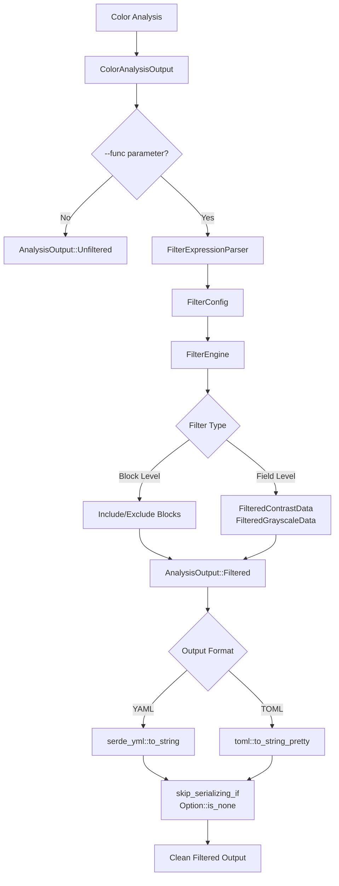
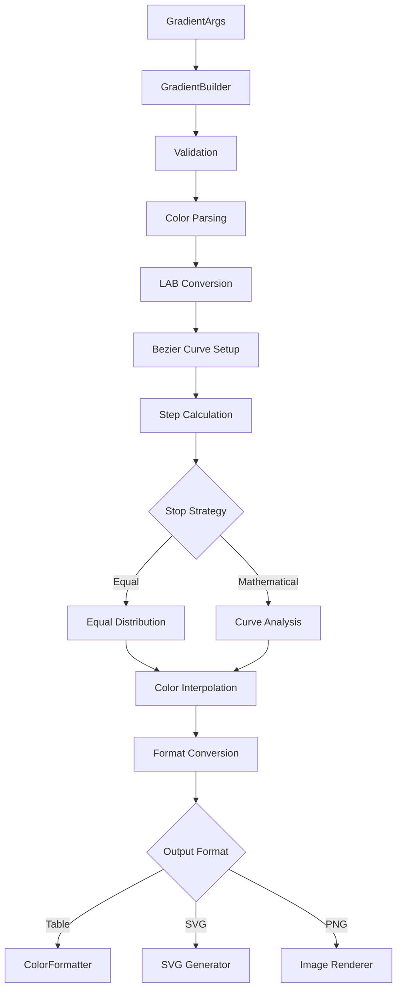

# Color-rs Architecture v0.16.0

This document describes the **pure functional programming architecture** achieved in color-rs v0.16.0 after the complete GoF pattern migration, including crate topology, module organization, and data flow.

## Architectural Philosophy

### Pure Functional Programming Architecture (v0.16.0) ✅ COMPLETE

Color-rs v0.16.0 represents a **complete architectural transformation** to pure functional programming in Rust:

- **100% Pure Functions**: All core operations use immutable inputs and deterministic outputs
- **Zero GoF Patterns**: Complete elimination of traditional object-oriented design patterns
- **Enum-Based Dispatch**: Type-safe pattern matching replaces trait object polymorphism
- **Immutable Data Structures**: All color transformations are side-effect free
- **Functional Composition**: Complex behaviors built through mathematical function composition
- **Type-Driven Safety**: Rust's enum and struct systems provide compile-time guarantees

### Migration Completion Status ✅

**✅ ALL PATTERNS SUCCESSFULLY MIGRATED (Phase 0.16.0)**:
- ✅ Strategy Pattern → `DistanceAlgorithm` enum + pure function dispatch  
- ✅ Template Method → Higher-order functions + `color_matching_functional`
- ✅ Factory Pattern → Function composition + `color_parser_functional`
- ✅ Command Pattern → Value types + `command_functional`
- ✅ Builder Pattern → Immutable `GradientConfig` + smart constructors
- ✅ Facade Pattern → Organized `color_ops` module structure

**Current 100% Functional Patterns**:
- ✅ **Enum Dispatch Pattern**: Type-safe algorithm selection without runtime polymorphism
- ✅ **Smart Constructor Pattern**: Validated data construction with `Result` types
- ✅ **Function Composition Pattern**: Building complex operations from simple functions
- ✅ **Immutable Configuration Pattern**: Side-effect free configuration management
- ✅ **Pure Function Pipeline Pattern**: Deterministic data transformations
- ✅ **Module Organization Pattern**: Clear functional boundaries and dependencies

## Module Topology

### Functional Module Organization

The architecture follows **functional programming principles** with clear separation between pure functions, data transformations, and side effects:

```mermaid
graph TB
    subgraph "Public API (lib.rs) - Pure Function Exports"
        lib[lib.rs]
        lib --> cli[cli.rs]
        lib --> color[color.rs]
        lib --> error[error.rs]
        lib --> gradient[gradient.rs]
        lib --> image[image.rs]
    end
    
    subgraph "Core Color Operations - Pure Functions"
        color --> color_utils[color_utils/ - Pure transformations]
        color --> color_formatter[color_formatter.rs - String formatting]
        color --> color_operations_facade[color_operations_facade.rs - ⚠️ Being migrated]
        color --> color_distance_strategies[color_distance_strategies.rs - ❌ Strategy Pattern → Function Enum]
        color --> color_matching_template[color_matching_template.rs - ❌ Template Method → HOF]
    end
    
    subgraph "Color Parsing System - Function Composition"
        color --> color_parser_factory[color_parser_factory.rs - ❌ Factory → Pure Functions]
        color_parser_factory --> color_parser[color_parser/]
        
        subgraph "color_parser/ - Pure Parsers"
            color_parser --> mod_rs[mod.rs - Function exports]
            color_parser --> types[types.rs - Data types]
            color_parser --> parse_utils[parse_utils.rs - Helper functions]
            color_parser --> css_parser[css_parser.rs - CSS parsing]
            color_parser --> css_collection[css_collection.rs - Static data]
            color_parser --> ral_matcher[ral_matcher.rs - Matching algorithms]
            color_parser --> ral_classic_collection[ral_classic_collection.rs - Static data]
            color_parser --> ral_design_collection[ral_design_collection.rs - Static data]
            color_parser --> csv_loader[csv_loader.rs - Data loading]
            color_parser --> collections[collections.rs - Collection operations]
            color_parser --> unified_manager[unified_manager.rs - Collection coordination]
            color_parser --> compat[compat.rs - Compatibility layer]
        end
    end
    
    subgraph "Gradient System - Function Composition"
        gradient --> gradient_builder[gradient_builder.rs - ⚠️ Builder → Immutable Config]
        gradient_builder --> gradient_calc[gradient/ - Pure calculation functions]
        
        subgraph "gradient/ - Pure Gradient Functions"
            gradient_calc --> calculator[calculator.rs - Math functions]
            gradient_calc --> easing[easing.rs - Timing functions] 
            gradient_calc --> output[output.rs - Generation functions]
        end
    end
    
    subgraph "Output System"
        color --> output_formats[output_formats.rs]
        color --> output_filter[output_filter.rs]
        color --> file_output[file_output.rs]
        color --> format_utils[format_utils.rs]
        color --> output_utils[output_utils.rs]
        color --> precision_utils[precision_utils.rs]
    end
    
    subgraph "Color Schemes"
        color --> color_schemes[color_schemes.rs]
    end
    
    subgraph "Utilities"
        utils[utils.rs]
        config[config.rs]
    end
    
    subgraph "External Data"
        csv_data[color-table/*.csv]
        csv_data --> csv_loader
    end
    
    main[main.rs] --> cli
    cli --> color
    cli --> gradient
    cli --> image
```



## Public vs Private Modules

### Public Modules (Re-exported from lib.rs)
The following modules and types are part of the public API:

- **`cli`**: Command-line interface structures and argument parsing
  - `Cli`, `Commands`, `GradientArgs`, `ColorMatchArgs`
- **`color`**: Core color types and operations
  - `ColorInfo`, `ColorSpace`
- **`color_distance_strategies`**: Pluggable distance calculation algorithms
  - `ColorDistanceStrategy`, `available_strategies()`, `create_strategy()`
- **`color_matching_template`**: Template method for color matching
  - `ColorMatchingTemplate`, `UnifiedColorMatcher`
- **`color_operations_facade`**: Simplified interface for color operations
  - `ColorOperationsFacade`, `ColorAnalysis`
- **`color_parser`**: Universal color parsing system
  - `ColorMatch`, `SearchFilter`, `UnifiedColorManager`, `UniversalColor`
- **`color_parser_factory`**: Factory for creating color parsers
  - `ColorParserFactory`, `ColorParserTrait`, `ColorParserType`, `ColorParserConfig`
- **`color_utils`**: Core color manipulation utilities
  - `ColorUtils`
- **`error`**: Error handling types
  - `ColorError`, `Result`
- **`gradient`**: Gradient calculation and generation
  - `GradientCalculator`, `GradientValue`
- **`gradient_builder`**: Fluent builder for gradient configuration
  - `GradientBuilder`
- **`image`**: Image generation and export
  - `ImageGenerator`, `ImageFormat`
- **`output_filter`**: Selective output filtering system
  - `FilterEngine`, `FilterConfig`, `FilterRule`, `AnalysisOutput`

### Private Modules
These modules are implementation details not exposed in the public API:

- **`config`**: Internal configuration constants and settings
- **`main`**: CLI application entry point
- **`utils`**: Internal utility functions
- **`color_formatter`**: Internal formatting logic for color output
- **`output_formats`**: Output data structure definitions
- **`file_output`**: File writing and export utilities
- **`format_utils`**: Output formatting helper functions
- **`output_utils`**: Output processing utilities
- **`precision_utils`**: Numeric precision control for output

### Color Parser Submodules
The `color_parser` module contains several submodules that implement different parsing strategies:

- **`types`**: Core type definitions for color parsing
- **`parse_utils`**: Shared parsing utilities and helper functions
- **`css_parser`**: CSS color specification parser
- **`css_collection`**: CSS named color collection
- **`ral_matcher`**: RAL color matching algorithms
- **`ral_classic_collection`**: RAL Classic color collection (213 colors)
- **`ral_design_collection`**: RAL Design System+ collection (1825 colors)
- **`csv_loader`**: CSV file loading and parsing utilities
- **`collections`**: Unified interface for all color collections
- **`unified_manager`**: Central manager for all color parsing operations
- **`compat`**: Compatibility layer for different color formats

## Data Flow Architecture

### Functional Processing Pipeline

The color-rs architecture follows **functional programming principles** with immutable data transformations and pure function composition:

```mermaid
flowchart TD
    A[User Input] --> B{Input Type?}
    B -->|CLI Command| C[CLI Parser - clap]
    B -->|Library Call| D[Public API]
    
    C --> E[Immutable Args Structures]
    D --> E
    
    E --> F[Pure Parser Functions]
    F --> G[Result<Color, Error>]
    
    G --> H{Color Format}
    H -->|HEX| I[parse_hex() -> Result<Color>]
    H -->|RGB/HSL| J[parse_rgb() -> Result<Color>]
    H -->|Named| K[lookup_named() -> Result<Color>]
    H -->|RAL| L[match_ral() -> Result<Color>]
    
    I --> M[Pure Color Transformations]
    J --> M
    K --> N[Static Collections]
    L --> N
    
    N --> O[Color Analysis Pipeline]
    M --> O
    
    O --> P[Function Composition Chain]
    P --> Q{Output Type}
    Q -->|Analysis| R[format_analysis() -> String]
    Q -->|Gradient| S[generate_gradient() -> Result<Output>]
    Q -->|Image| T[create_image() -> Result<PathBuf>]
    
    R --> U[Pure Output Functions]
    S --> V[Pure File Generation]
    T --> V
```

### Functional Data Transformations

**Input → Parse → Transform → Output** pipeline using pure functions:

1. **Parse Phase**: `String -> Result<Color, ParseError>`
2. **Transform Phase**: `Color -> ColorAnalysis` (pure computations)  
3. **Output Phase**: `ColorAnalysis -> String` (pure formatting)

### Collection Processing with Functional Patterns

```mermaid
flowchart LR
    A[Static Data] --> B[Pure Loading Functions]
    B --> C[Immutable Collections]
    
    subgraph "Functional Collections"
        C --> D[css_colors() -> &'static [Color]]
        C --> E[ral_classic() -> &'static [Color]]
        C --> F[ral_design() -> &'static [Color]]
    end
    
    D --> G[Pure Matching Functions]
    E --> G
    F --> G
    
    G --> H[find_closest(color, collection) -> Option<Match>]
    H --> I[calculate_distance(c1, c2, algorithm) -> f64]
    I --> J[Pure Result Types]
```

### Output Filtering Architecture



#### Filter Expression Grammar

```
filter_expression := '[' filter_list ']'
filter_list := filter_item (',' filter_item)*
filter_item := 'all' | block_name | field_name | exclusion
exclusion := '!' (block_name | field_name)
block_name := identifier
field_name := identifier '.' identifier
identifier := [a-zA-Z0-9_]+
```

#### Filter Processing Flow

1. **Expression Parsing**: `FilterExpressionParser` converts string expressions into `FilterRule` enums
2. **Configuration Building**: `FilterConfig` aggregates rules and determines inclusion strategy
3. **Selective Construction**: `FilterEngine` creates `FilteredColorAnalysisOutput` with `Option<T>` fields
4. **Conditional Serialization**: `skip_serializing_if = "Option::is_none"` omits unselected content

### Gradient Generation Flow



## Functional Programming Patterns in Architecture

### Pattern Migration Progress (v0.15.4 → v0.16.0)

**Migration Status**:
- ❌ **Strategy Pattern** → **Enum + Pattern Matching**: Replace trait objects with pure functions
- ❌ **Factory Pattern** → **Function Composition**: Replace object creation with pure constructors  
- ❌ **Template Method** → **Higher-Order Functions**: Replace inheritance with function composition
- ❌ **Command Pattern** → **Function Pipelines**: Replace trait objects with Result monads
- ⚠️ **Builder Pattern** → **Immutable Configuration**: Replace mutable builders with config structs
- ⚠️ **Facade Pattern** → **Module Organization**: Already partially functional, needs cleanup

### Current Functional Patterns (v0.15.4+)

1. **Lens Pattern**: Safe data access and transformation for ColorAnalysisResult
2. **Prism Pattern**: Sum type operations for ColorFormat enum variants
3. **Traversal Pattern**: Collection processing for color matching and validation
4. **Monad Pattern**: Result<T, E> and Option<T> chaining for error handling
5. **Function Composition**: Pure function pipelines for data transformations

### Functional Architecture Benefits

- **Immutability**: All data transformations use immutable inputs
- **Pure Functions**: Deterministic outputs with no side effects for core operations
- **Type Safety**: Compile-time guarantees through Rust's type system
- **Performance**: Elimination of heap allocations from trait objects
- **Testability**: Pure functions are easier to test and reason about
- **Maintainability**: Clear data flow without hidden state mutations

### Recent Architectural Improvements (v0.15.4)

**Functional Programming Foundation**:
- **Pure Distance Calculations**: All distance algorithms implemented as pure functions
- **Immutable Color Transformations**: Color space conversions use immutable data
- **Function-Based Parsing**: Color parsing functions return Result<T, E> consistently
- **Static Collections**: Color data stored as static immutable collections
- **Pure Output Generation**: Formatting functions with no side effects

## Feature Flags and Configuration

Currently, the crate does not use feature flags but is designed to support them for:

- Optional image generation dependencies (`image`, `tiny-skia`, `usvg`, `resvg`)
- Optional CLI interface (`clap`)
- Different color collection backends
- Performance optimizations for specific use cases

## Memory and Performance Considerations

- **Color Collections**: Loaded once and cached in memory for fast lookups
- **LAB Conversions**: Computed on-demand, cached where beneficial
- **Image Generation**: Uses minimal memory streaming for large images
- **Gradient Calculations**: Vectorized operations where possible using `palette` library optimizations
