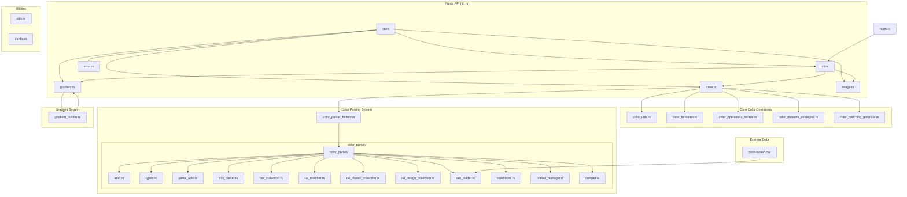
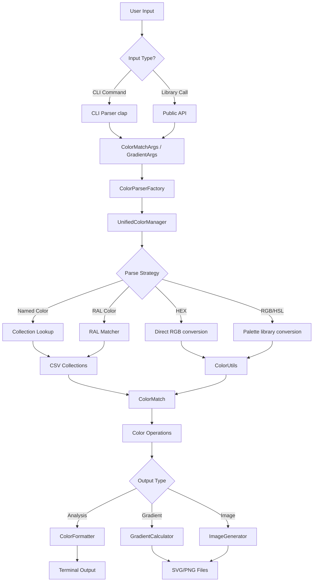
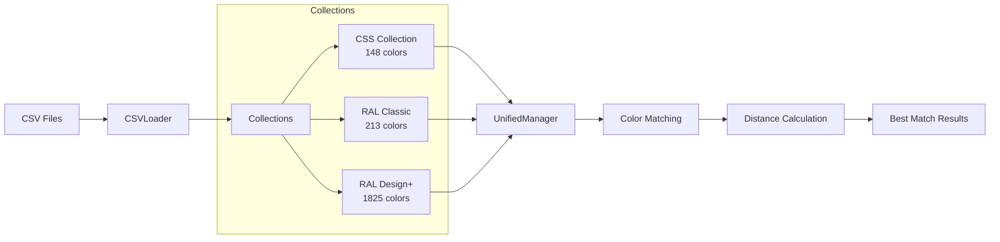
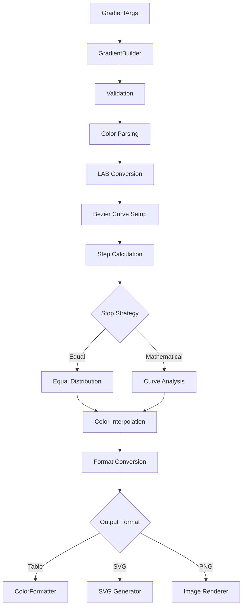

# Color-rs Architecture

This document describes the crate and module topology, public vs private modules, and data flow in the color-rs project.

## Module Topology

## Public vs Private Modules

### Public Modules (Re-exported from lib.rs)
The following modules and types are part of the public API:

- **`cli`**: Command-line interface structures and argument parsing
  - `Cli`, `Commands`, `GradientArgs`, `ColorMatchArgs`
- **`color`**: Core color types and operations
  - `ColorInfo`, `ColorSpace`
- **`color_distance_strategies`**: Pluggable distance calculation algorithms
  - `ColorDistanceStrategy`, `available_strategies()`, `create_strategy()`
- **`color_matching_template`**: Template method for color matching
  - `ColorMatchingTemplate`, `UnifiedColorMatcher`
- **`color_operations_facade`**: Simplified interface for color operations
  - `ColorOperationsFacade`, `ColorAnalysis`
- **`color_parser`**: Universal color parsing system
  - `ColorMatch`, `SearchFilter`, `UnifiedColorManager`, `UniversalColor`
- **`color_parser_factory`**: Factory for creating color parsers
  - `ColorParserFactory`, `ColorParserTrait`, `ColorParserType`, `ColorParserConfig`
- **`color_utils`**: Core color manipulation utilities
  - `ColorUtils`
- **`error`**: Error handling types
  - `ColorError`, `Result`
- **`gradient`**: Gradient calculation and generation
  - `GradientCalculator`, `GradientValue`
- **`gradient_builder`**: Fluent builder for gradient configuration
  - `GradientBuilder`
- **`image`**: Image generation and export
  - `ImageGenerator`, `ImageFormat`

### Private Modules
These modules are implementation details not exposed in the public API:

- **`config`**: Internal configuration constants and settings
- **`main`**: CLI application entry point
- **`utils`**: Internal utility functions
- **`color_formatter`**: Internal formatting logic for color output

### Color Parser Submodules
The `color_parser` module contains several submodules that implement different parsing strategies:

- **`types`**: Core type definitions for color parsing
- **`parse_utils`**: Shared parsing utilities and helper functions
- **`css_parser`**: CSS color specification parser
- **`css_collection`**: CSS named color collection
- **`ral_matcher`**: RAL color matching algorithms
- **`ral_classic_collection`**: RAL Classic color collection (213 colors)
- **`ral_design_collection`**: RAL Design System+ collection (1825 colors)
- **`csv_loader`**: CSV file loading and parsing utilities
- **`collections`**: Unified interface for all color collections
- **`unified_manager`**: Central manager for all color parsing operations
- **`compat`**: Compatibility layer for different color formats

## Data Flow Architecture

### Color Input Processing Pipeline

### Color Collection Data Flow

### Gradient Generation Flow

## Design Patterns in Architecture

### Currently Implemented Patterns

1. **Strategy Pattern**: `ColorDistanceStrategy` allows pluggable distance calculation algorithms
2. **Factory Pattern**: `ColorParserFactory` creates different types of color parsers
3. **Builder Pattern**: `GradientBuilder` provides fluent configuration interface
4. **Facade Pattern**: `ColorOperationsFacade` simplifies complex color operations
5. **Template Method Pattern**: `ColorMatchingTemplate` standardizes matching algorithms

### Architectural Benefits

- **Modularity**: Clear separation between parsing, calculation, and output generation
- **Extensibility**: Easy to add new color formats, distance algorithms, or output formats
- **Type Safety**: Rust's type system prevents invalid color operations
- **Performance**: LAB color space ensures perceptually uniform gradients
- **Maintainability**: Design patterns provide clear structure and responsibilities

## Feature Flags and Configuration

Currently, the crate does not use feature flags but is designed to support them for:

- Optional image generation dependencies (`image`, `tiny-skia`, `usvg`, `resvg`)
- Optional CLI interface (`clap`)
- Different color collection backends
- Performance optimizations for specific use cases

## Memory and Performance Considerations

- **Color Collections**: Loaded once and cached in memory for fast lookups
- **LAB Conversions**: Computed on-demand, cached where beneficial
- **Image Generation**: Uses minimal memory streaming for large images
- **Gradient Calculations**: Vectorized operations where possible using `palette` library optimizations
