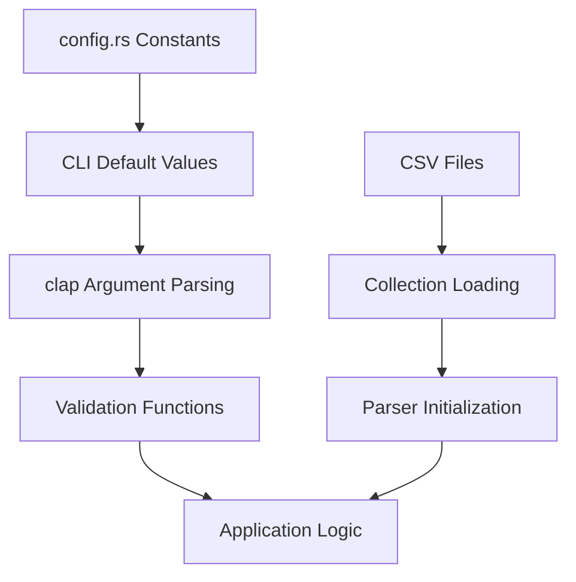

# Color-rs Configuration

This document describes user-configurable settings, file formats, default search paths, and precedence rules for configuration management in color-rs.

## Table of Contents

- [Current Configuration State](#current-configuration-state)
- [Configuration Architecture](#configuration-architecture)
- [Planned Configuration System](#planned-configuration-system)
- [File Formats](#file-formats)
- [Search Paths](#search-paths)
- [Precedence Rules](#precedence-rules)
- [Environment Variables](#environment-variables)

## Current Configuration State

As of version 0.11.1, color-rs uses **compile-time configuration** through constants defined in `src/config.rs`. There is no runtime configuration file system yet.

### Compile-time Constants

```rust
// Application metadata
pub const APP_NAME: &str = "color-rs";
pub const APP_VERSION: &str = env!("CARGO_PKG_VERSION");
pub const APP_DESCRIPTION: &str = "Professional color gradient calculations using LAB color space";
pub const APP_AUTHOR: &str = "al-siv <https://github.com/al-siv>";

// Default values for CLI arguments
pub const DEFAULT_START_POSITION: &str = "0";
pub const DEFAULT_END_POSITION: &str = "100";
pub const DEFAULT_EASE_IN: &str = "0.65";
pub const DEFAULT_EASE_OUT: &str = "0.35";
pub const DEFAULT_WIDTH: &str = "1000";
pub const DEFAULT_SVG_NAME: &str = "gradient.svg";
pub const DEFAULT_PNG_NAME: &str = "gradient.png";
pub const DEFAULT_GRAD_STEP: &str = "5";

// Constraints and limits
pub const MAX_PERCENTAGE: u8 = 100;
pub const BEZIER_MIN: f64 = 0.0;
pub const BEZIER_MAX: f64 = 1.0;
pub const HEX_COLOR_LENGTH: usize = 6;
pub const RGB_MAX: u8 = 255;
pub const RGB_MAX_F32: f64 = 255.0;
pub const PERCENTAGE_MULTIPLIER: f64 = 100.0;
```

### Color Collection Configuration

Color collections are currently loaded from CSV files in the `color-table/` directory:

- `color-table/css-colors.csv` - 148 CSS named colors
- `color-table/ral-classic.csv` - 213 RAL Classic colors  
- `color-table/ral-design.csv` - 1825 RAL Design System+ colors

## Configuration Architecture

### Current Design Principles

1. **Compile-time Safety**: All defaults are compile-time constants
2. **CLI-first**: Configuration through command-line arguments
3. **No Hidden State**: All configuration is explicit in command usage
4. **Immutable Defaults**: Constants cannot be accidentally modified

### Data Flow



## Planned Configuration System

### Future Configuration Architecture

The following configuration system is planned for future versions:

#### Configuration Hierarchy

1. **CLI Arguments** (highest precedence)
2. **Environment Variables**
3. **User Configuration File**
4. **Project Configuration File**
5. **Global Configuration File**
6. **Compiled Defaults** (lowest precedence)

#### Planned Configuration Structure

```toml
# ~/.config/color-rs/config.toml

[defaults]
# Default gradient settings
ease_in = 0.65
ease_out = 0.35
gradient_step = 5
image_width = 1000

# Default output settings
svg_enabled = false
png_enabled = false
legend_enabled = true

[collections]
# Color collection settings
css_colors_enabled = true
ral_classic_enabled = true
ral_design_enabled = true
auto_reload = false
cache_enabled = true

[distance]
# Default distance calculation method
default_method = "delta-e-2000"
available_methods = ["delta-e-76", "delta-e-2000", "euclidean-lab"]

[output]
# Output formatting preferences
table_style = "modern"
color_names = true
decimal_places = 2
contrast_warnings = true

[paths]
# Custom paths for collections and output
color_collections = "~/.config/color-rs/collections"
output_directory = "."
temp_directory = "/tmp/color-rs"

[performance]
# Performance tuning
parser_cache_size = 1000
collection_preload = true
parallel_processing = true
```

## File Formats

### Supported Configuration Formats

#### TOML (Recommended)
- **Pros**: Human-readable, comments support, strong typing
- **Cons**: Additional dependency
- **Use case**: Primary configuration format

```toml
[defaults]
ease_in = 0.65
ease_out = 0.35

[collections]
css_colors_enabled = true
```

#### JSON (Planned)
- **Pros**: Widely supported, no additional dependencies
- **Cons**: No comments, less human-readable
- **Use case**: Programmatic configuration, CI/CD

```json
{
  "defaults": {
    "ease_in": 0.65,
    "ease_out": 0.35
  },
  "collections": {
    "css_colors_enabled": true
  }
}
```

#### YAML (Under Consideration)
- **Pros**: Very human-readable
- **Cons**: Complex parsing, indentation-sensitive
- **Use case**: Complex nested configurations

```yaml
defaults:
  ease_in: 0.65
  ease_out: 0.35
  
collections:
  css_colors_enabled: true
```

### Color Collection Formats

#### CSV (Current)
Used for color collection data:

```csv
name,hex,code
"Absolute Zero","#0048BA","HTML"
"Acid Green","#B0BF1A","CSS"
```

**Schema**:
- `name`: Human-readable color name
- `hex`: Hex color value (#RRGGBB)
- `code`: Collection-specific code (optional)

## Search Paths

### Configuration File Search Order

The planned configuration system will search for files in this order:

#### Unix-like Systems (Linux, macOS)

1. **Command-line specified**: `--config /path/to/config.toml`
2. **Current directory**: `./color-rs.toml`
3. **Project directory**: `./.color-rs/config.toml`
4. **User config**: `~/.config/color-rs/config.toml`
5. **User home**: `~/.color-rs.toml`
6. **System-wide**: `/etc/color-rs/config.toml`

#### Windows

1. **Command-line specified**: `--config C:\path\to\config.toml`
2. **Current directory**: `.\color-rs.toml`
3. **Project directory**: `.\.color-rs\config.toml`
4. **User config**: `%APPDATA%\color-rs\config.toml`
5. **User profile**: `%USERPROFILE%\.color-rs.toml`
6. **System-wide**: `%PROGRAMDATA%\color-rs\config.toml`

### Color Collection Search Paths

1. **Embedded collections** (compiled into binary)
2. **User collections**: `~/.config/color-rs/collections/`
3. **Project collections**: `./.color-rs/collections/`
4. **System collections**: `/usr/share/color-rs/collections/`

## Precedence Rules

### Configuration Value Resolution

Configuration values are resolved in this order (highest to lowest precedence):

1. **CLI Arguments**
   ```bash
   color-rs gradient red blue --ease-in 0.5
   ```

2. **Environment Variables**
   ```bash
   export COLOR_RS_EASE_IN=0.5
   color-rs gradient red blue
   ```

3. **User Configuration File**
   ```toml
   [defaults]
   ease_in = 0.5
   ```

4. **Project Configuration File**
   ```toml
   # .color-rs/config.toml
   [defaults]
   ease_in = 0.4
   ```

5. **Global Configuration File**
   ```toml
   # /etc/color-rs/config.toml
   [defaults]
   ease_in = 0.3
   ```

6. **Compiled Defaults**
   ```rust
   pub const DEFAULT_EASE_IN: &str = "0.65";
   ```

### Example Resolution

Given these configurations:

```bash
# CLI
color-rs gradient red blue --ease-in 0.8

# Environment  
export COLOR_RS_EASE_OUT=0.2

# User config file
[defaults]
ease_in = 0.5
ease_out = 0.4
gradient_step = 10

# Compiled defaults
ease_in = 0.65
ease_out = 0.35
gradient_step = 5
```

**Final values**:
- `ease_in = 0.8` (from CLI)
- `ease_out = 0.2` (from environment)
- `gradient_step = 10` (from config file)

## Environment Variables

### Planned Environment Variables

#### Core Settings
- `COLOR_RS_CONFIG_PATH` - Path to configuration file
- `COLOR_RS_COLLECTIONS_PATH` - Path to color collections directory
- `COLOR_RS_OUTPUT_DIR` - Default output directory for generated files
- `COLOR_RS_CACHE_DIR` - Directory for caching parsed collections

#### Default Values
- `COLOR_RS_EASE_IN` - Default ease-in value (0.0-1.0)
- `COLOR_RS_EASE_OUT` - Default ease-out value (0.0-1.0)
- `COLOR_RS_GRADIENT_STEP` - Default gradient step percentage (1-100)
- `COLOR_RS_IMAGE_WIDTH` - Default image width in pixels
- `COLOR_RS_DISTANCE_METHOD` - Default color distance calculation method

#### Feature Flags
- `COLOR_RS_ENABLE_CSS_COLORS` - Enable CSS color collection (true/false)
- `COLOR_RS_ENABLE_RAL_CLASSIC` - Enable RAL Classic collection (true/false)
- `COLOR_RS_ENABLE_RAL_DESIGN` - Enable RAL Design+ collection (true/false)
- `COLOR_RS_ENABLE_CACHE` - Enable color collection caching (true/false)

#### Output Control
- `COLOR_RS_DEFAULT_SVG` - Generate SVG by default (true/false)
- `COLOR_RS_DEFAULT_PNG` - Generate PNG by default (true/false)
- `COLOR_RS_SHOW_LEGEND` - Show legend on images by default (true/false)
- `COLOR_RS_TABLE_STYLE` - Default table style (modern/classic/minimal)

### Environment Variable Examples

```bash
# Set default easing
export COLOR_RS_EASE_IN=0.42
export COLOR_RS_EASE_OUT=0.58

# Configure collections
export COLOR_RS_COLLECTIONS_PATH="$HOME/my-colors"
export COLOR_RS_ENABLE_RAL_DESIGN=false

# Output preferences
export COLOR_RS_DEFAULT_SVG=true
export COLOR_RS_IMAGE_WIDTH=1600
export COLOR_RS_OUTPUT_DIR="./gradients"

# Performance tuning
export COLOR_RS_ENABLE_CACHE=true
export COLOR_RS_CACHE_DIR="/tmp/color-rs-cache"
```

## Configuration Validation

### Planned Validation Rules

1. **Type Validation**: Ensure values match expected types
2. **Range Validation**: Check numeric values are within valid ranges
3. **Path Validation**: Verify file and directory paths exist and are accessible
4. **Dependency Validation**: Ensure dependent settings are consistent

### Validation Examples

```rust
// Planned validation implementation
pub struct ConfigValidator;

impl ConfigValidator {
    pub fn validate_ease_value(value: f64) -> Result<()> {
        if value < 0.0 || value > 1.0 {
            return Err(ConfigError::InvalidRange {
                field: "ease_in/ease_out",
                value: value.to_string(),
                min: "0.0",
                max: "1.0",
            });
        }
        Ok(())
    }
    
    pub fn validate_path(path: &str) -> Result<PathBuf> {
        let expanded = shellexpand::full(path)
            .map_err(|e| ConfigError::InvalidPath(path.to_string(), e.to_string()))?;
        Ok(PathBuf::from(expanded.as_ref()))
    }
}
```

## Migration and Compatibility

### Version Compatibility

- **Configuration format versioning** to handle breaking changes
- **Automatic migration** of old configuration files
- **Deprecation warnings** for removed settings
- **Backward compatibility** for at least one major version

### Migration Strategy

```toml
# Configuration file header
[meta]
version = "1.0"
created_by = "color-rs v0.12.0"
last_updated = "2025-07-17T10:30:00Z"

# Rest of configuration...
```

## Implementation Timeline

### Phase 1: Basic Configuration (v0.12.0)
- TOML configuration file support
- Basic environment variable support
- Simple validation

### Phase 2: Advanced Features (v0.13.0)
- Multiple format support (JSON, YAML)
- Complex search path resolution
- Configuration schemas and validation

### Phase 3: Dynamic Configuration (v0.14.0)
- Runtime configuration reloading
- Configuration profiles
- Advanced caching and performance optimization
