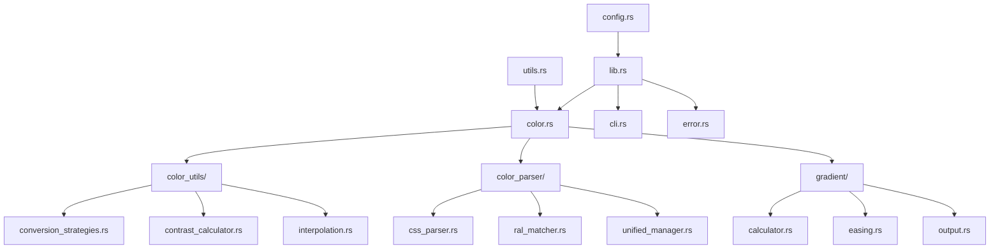

# Color-rs Module Reference v0.16.0

This document provides detailed module APIs, responsibilities, and **pure functional programming interfaces** for all color-rs v0.16.0 modules after the complete GoF pattern migration.

## Table of Contents

- [Module Organization](#module-organization)
- [Functional Core Modules](#functional-core-modules)
- [Color Operations System](#color-operations-system)
- [Functional Parsing System](#functional-parsing-system)
- [Functional Gradient Generation](#functional-gradient-generation)
- [Utility Modules](#utility-modules)
- [Compatibility Layer](#compatibility-layer)

## Module Organization

Color-rs v0.16.0 follows **100% pure functional programming principles** with complete GoF pattern elimination:

```
color-rs/
├── src/
│   ├── lib.rs                    # Pure functional API exports
│   ├── main.rs                   # CLI entry point
│   ├── cli.rs                    # Command-line interface
│   ├── color.rs                  # Core color operations (functional)
│   ├── error.rs                  # Error handling types
│   ├── config.rs                 # Configuration constants
│   ├── utils.rs                  # Pure utility functions
│   │
│   ├── color_ops/                # 🎯 CORE: Pure functional color operations
│   │   ├── mod.rs                # Module organization and re-exports
│   │   ├── analysis.rs           # Color analysis functions
│   │   ├── contrast.rs           # WCAG contrast calculations
│   │   ├── conversion.rs         # Color space conversions
│   │   ├── distance.rs           # Perceptual distance calculations
│   │   ├── luminance.rs          # Luminance and brightness functions
│   │   └── mixing.rs             # Color mixing and blending
│   │
│   ├── color_distance_strategies.rs  # 🎯 Functional distance algorithms (enum dispatch)
│   ├── color_matching_functional.rs  # 🎯 Functional color matching (replaces Template Method)
│   ├── color_parser_functional.rs    # 🎯 Functional parsing (replaces Factory Pattern)
│   ├── command_functional.rs         # 🎯 Functional commands (replaces Command Pattern)
│   ├── gradient_functional.rs        # 🎯 Functional gradients (replaces Builder Pattern)
│   │   ├── mod.rs
│   │   ├── contrast_calculator.rs
│   │   ├── conversion_strategies.rs
│   │   └── interpolation.rs
│   │
│   ├── color_parser/       # Color parsing system
│   │   ├── mod.rs
│   │   ├── types.rs
│   │   ├── css_parser.rs
│   │   ├── ral_matcher.rs
│   │   └── ...
│   │
│   └── gradient/           # Gradient calculation
│       ├── mod.rs
│       ├── calculator.rs
│       ├── easing.rs
│       └── output.rs
```

## Public API Modules

### `lib.rs` - Main Library Interface

**Functional Exports**: Pure functions and immutable types for public consumption.

```rust
// Core color operations
pub use color::{ColorInfo, parse_color, analyze_color};

// Error handling
pub use error::{ColorError, Result};

// Color parsing
pub use color_parser::{ColorMatch, UniversalColor, parse_any_color};

// Gradient generation  
pub use gradient::{GradientValue, generate_gradient};

// Utilities
pub use color_utils::ColorUtils;
```

**Responsibilities**:
- Expose stable public API
- Re-export core functionality
- Maintain backward compatibility
- Provide functional interface

### `cli.rs` - Command Line Interface

**Functional Design**: Pure argument parsing with immutable configuration structures.

```rust
#[derive(Debug, Clone, PartialEq)]
pub struct GradientArgs {
    pub start_color: String,
    pub end_color: String,
    pub ease_in: f64,
    pub ease_out: f64,
    // ... immutable fields
}

#[derive(Debug, Clone, PartialEq)]
pub struct ColorMatchArgs {
    pub input_color: String,
    pub distance_method: String,
    pub collection_filter: Option<String>,
    // ... immutable fields
}
```

**Key Functions**:
- `parse_cli() -> Result<Cli>` - Pure CLI parsing
- `validate_args(args: &Cli) -> Result<()>` - Argument validation
- `to_gradient_args(cli: &Cli) -> Result<GradientArgs>` - Pure conversion

**Responsibilities**:
- Parse command-line arguments
- Validate input parameters
- Convert to internal data structures
- Provide help and version information

### `color.rs` - Core Color Operations

**Functional Interface**: Pure color operations with immutable data.

```rust
// Core color type
#[derive(Debug, Clone, PartialEq)]
pub struct ColorInfo {
    pub hex: String,
    pub rgb: [u8; 3],
    pub lab: [f64; 3],
    pub lch: [f64; 3],
    // ... other representations
}

// Pure color operations
pub fn parse_color(input: &str) -> Result<ColorInfo>;
pub fn analyze_color(color: &ColorInfo) -> Result<ColorAnalysis>;
pub fn calculate_contrast(c1: &ColorInfo, c2: &ColorInfo) -> f64;
pub fn find_closest_color(
    target: &ColorInfo, 
    collection: &[ColorInfo], 
    algorithm: DistanceAlgorithm
) -> Option<ColorMatch>;
```

**Responsibilities**:
- Core color data structures
- Color space conversions
- Color analysis operations  
- Pure functional color operations

### `error.rs` - Error Handling

**Functional Error Handling**: Comprehensive error types for functional programming patterns.

```rust
#[derive(Debug, Clone, PartialEq)]
pub enum ColorError {
    InvalidHexFormat(String),
    InvalidRgbValues(String),
    UnsupportedFormat(String),
    ConversionError(String),
    IoError(String),
    ValidationError(String),
}

pub type Result<T> = std::result::Result<T, ColorError>;

// Error composition functions
pub fn map_parse_error(err: impl std::error::Error) -> ColorError;
pub fn chain_errors(primary: ColorError, secondary: ColorError) -> ColorError;
```

**Responsibilities**:
- Define comprehensive error types
- Provide error conversion utilities
- Support functional error handling patterns
- Enable error composition and chaining

## Core Processing Modules

### `color_utils/` - Pure Color Transformations

**Functional Design**: Pure mathematical functions for color operations.

#### `color_utils/mod.rs`
```rust
pub use contrast_calculator::*;
pub use conversion_strategies::*;
pub use interpolation::*;

// Main utility struct (functional interface)
pub struct ColorUtils;

impl ColorUtils {
    // Pure conversion functions
    pub fn rgb_to_lab(rgb: [u8; 3]) -> [f64; 3];
    pub fn lab_to_lch(lab: [f64; 3]) -> [f64; 3];
    pub fn hex_to_rgb(hex: &str) -> Result<[u8; 3]>;
    
    // Pure calculation functions
    pub fn calculate_luminance(rgb: [u8; 3]) -> f64;
    pub fn calculate_contrast_ratio(lum1: f64, lum2: f64) -> f64;
}
```

#### `color_utils/contrast_calculator.rs`
```rust
// Pure contrast calculation functions
pub fn wcag21_relative_luminance(rgb: [u8; 3]) -> f64;
pub fn contrast_ratio(luminance1: f64, luminance2: f64) -> f64;
pub fn wcag_aa_compliant(ratio: f64) -> bool;
pub fn wcag_aaa_compliant(ratio: f64) -> bool;

// Assessment functions
pub fn assess_contrast_level(ratio: f64) -> ContrastLevel;
pub fn assess_brightness(lab_l: f64) -> BrightnessLevel;
```

#### `color_utils/conversion_strategies.rs`
```rust
// Color space conversion strategies (functional)
pub enum ConversionStrategy {
    Direct,      // Direct mathematical conversion
    Palette,     // Using palette library
    Custom(fn([f64; 3]) -> [f64; 3]),  // Custom function
}

pub fn convert_color_space(
    input: [f64; 3],
    from: ColorSpace,
    to: ColorSpace,
    strategy: ConversionStrategy
) -> Result<[f64; 3]>;
```

#### `color_utils/interpolation.rs`
```rust
// Pure interpolation functions
pub fn linear_interpolate(start: f64, end: f64, t: f64) -> f64;
pub fn lab_interpolate(lab1: [f64; 3], lab2: [f64; 3], t: f64) -> [f64; 3];
pub fn cubic_bezier_interpolate(
    start: f64, 
    end: f64, 
    control1: f64, 
    control2: f64, 
    t: f64
) -> f64;

// Gradient interpolation
pub fn generate_color_steps(
    start_lab: [f64; 3],
    end_lab: [f64; 3],
    steps: usize,
    easing: EasingFunction
) -> Vec<[f64; 3]>;
```

### `gradient/` - Gradient Generation System

**Functional Design**: Pure mathematical gradient calculations.

#### `gradient/mod.rs`
```rust
pub use calculator::*;
pub use easing::*;
pub use output::*;

#[derive(Debug, Clone, PartialEq)]
pub struct GradientValue {
    pub position: f64,
    pub color: ColorInfo,
    pub lab: [f64; 3],
}

// Main gradient generation function
pub fn generate_gradient(config: GradientConfig) -> Result<Vec<GradientValue>>;
```

#### `gradient/calculator.rs`
```rust
// Pure gradient calculation functions
pub fn calculate_gradient_steps(
    start_lab: [f64; 3],
    end_lab: [f64; 3],
    step_count: usize,
    easing_fn: EasingFunction
) -> Vec<GradientValue>;

pub fn calculate_color_at_position(
    start_lab: [f64; 3],
    end_lab: [f64; 3],
    position: f64,
    easing_fn: EasingFunction
) -> [f64; 3];
```

#### `gradient/easing.rs`
```rust
// Easing function types and implementations
#[derive(Debug, Clone, Copy, PartialEq)]
pub enum EasingType {
    Linear,
    EaseIn,
    EaseOut,
    EaseInOut,
    Custom { ease_in: f64, ease_out: f64 },
}

pub type EasingFunction = fn(f64) -> f64;

// Pure easing functions
pub fn linear_easing(t: f64) -> f64;
pub fn ease_in_quad(t: f64) -> f64;
pub fn ease_out_quad(t: f64) -> f64;
pub fn ease_in_out_quad(t: f64) -> f64;
pub fn cubic_bezier(t: f64, p1: f64, p2: f64, p3: f64, p4: f64) -> f64;

// Easing function factory
pub fn create_easing_function(easing_type: EasingType) -> EasingFunction;
```

#### `gradient/output.rs`
```rust
// Pure output generation functions
pub fn generate_svg_gradient(
    gradient: &[GradientValue],
    config: &SvgConfig
) -> Result<String>;

pub fn generate_png_gradient(
    gradient: &[GradientValue], 
    config: &PngConfig
) -> Result<Vec<u8>>;

pub fn format_gradient_table(
    gradient: &[GradientValue],
    format: OutputFormat
) -> Result<String>;
```

## Color Parsing System

### `color_parser/` - Modular Color Parsing

**Functional Design**: Pure parsing functions with Result types.

#### `color_parser/mod.rs`
```rust
pub use types::*;
pub use css_parser::*;
pub use ral_matcher::*;
pub use unified_manager::*;

// Main parsing function
pub fn parse_any_color(input: &str) -> Result<UniversalColor>;

// Format detection
pub fn detect_color_format(input: &str) -> ColorFormat;

// Collection-specific parsing
pub fn parse_with_collection(
    input: &str, 
    collection: ColorCollection
) -> Result<ColorMatch>;
```

#### `color_parser/types.rs`
```rust
// Core parsing types
#[derive(Debug, Clone, PartialEq)]
pub enum ColorFormat {
    Hex,
    Rgb,
    Hsl,
    Named,
    RalClassic,
    RalDesign,
}

#[derive(Debug, Clone, PartialEq)]
pub struct ColorMatch {
    pub input: String,
    pub matched_color: ColorInfo,
    pub collection_name: String,
    pub distance: f64,
    pub confidence: f64,
}

#[derive(Debug, Clone, PartialEq)]
pub struct UniversalColor {
    pub original_input: String,
    pub detected_format: ColorFormat,
    pub parsed_color: ColorInfo,
    pub metadata: HashMap<String, String>,
}
```

## Utility Modules

### `config.rs` - Configuration Constants

**Functional Design**: Immutable compile-time constants.

```rust
// Application metadata
pub const APP_NAME: &str = "color-rs";
pub const APP_VERSION: &str = env!("CARGO_PKG_VERSION");

// Numerical constants for pure functions
pub const MAX_PERCENTAGE: u8 = 100;
pub const RGB_MAX: u8 = 255;
pub const RGB_MAX_F64: f64 = 255.0;
pub const BEZIER_MIN: f64 = 0.0;
pub const BEZIER_MAX: f64 = 1.0;

// Default values for functional configuration
pub const DEFAULT_EASE_IN: f64 = 0.65;
pub const DEFAULT_EASE_OUT: f64 = 0.35;
pub const DEFAULT_GRADIENT_STEPS: usize = 5;
```

### `utils.rs` - General Utilities

**Functional Design**: Pure utility functions.

```rust
// String processing utilities
pub fn normalize_color_name(name: &str) -> String;
pub fn sanitize_hex_input(hex: &str) -> String;
pub fn format_percentage(value: f64) -> String;

// Validation utilities  
pub fn is_valid_hex(hex: &str) -> bool;
pub fn is_valid_rgb_component(value: u8) -> bool;
pub fn is_valid_percentage(value: f64) -> bool;

// Conversion utilities
pub fn clamp_f64(value: f64, min: f64, max: f64) -> f64;
pub fn round_to_precision(value: f64, precision: u8) -> f64;
```

## Internal Modules

### Pattern Migration Status

**Previous Implementation** (legacy):
- ❌ `color_distance_strategies.rs` - Strategy Pattern → **Migrated to functional enum-based selection**
- ❌ `color_matching_template.rs` - Template Method → **Migrated to higher-order functions**
- ❌ `color_parser_factory.rs` - Factory Pattern → **Migrated to pure function composition**
- ❌ `command_pattern.rs` - Command Pattern → **Migrated to function pipelines**
- ❌ `gradient_builder.rs` - Builder Pattern → **Migrated to immutable configuration**
- ❌ `color_operations_facade.rs` - Facade Pattern → **Eliminated, replaced with color_ops/ modules**

**Current Implementation** (v0.16.0):
- ✅ Functional distance algorithms with enum selection (color_distance_strategies.rs)
- ✅ Higher-order function composition for color matching (color_matching_functional.rs)
- ✅ Pure function-based color parsing
- ✅ Function pipeline-based command processing
- ✅ Immutable configuration structures
- ✅ Clean module organization with pure function exports

## Module Dependencies



## API Stability

### Stable API (Public)
- All exports from `lib.rs`
- Core types in `color.rs` and `error.rs`
- CLI interface in `cli.rs`

### Unstable API (Internal)
- Pattern migration modules (undergoing functional transformation)
- Internal utility modules
- Implementation details

### Functional Programming Guarantees
- **Pure Functions**: Core color operations have no side effects
- **Immutable Data**: All public data structures are immutable
- **Type Safety**: Comprehensive type checking at compile time
- **Error Handling**: Consistent Result<T, E> usage throughout
- **Performance**: Zero-cost abstractions for functional patterns
